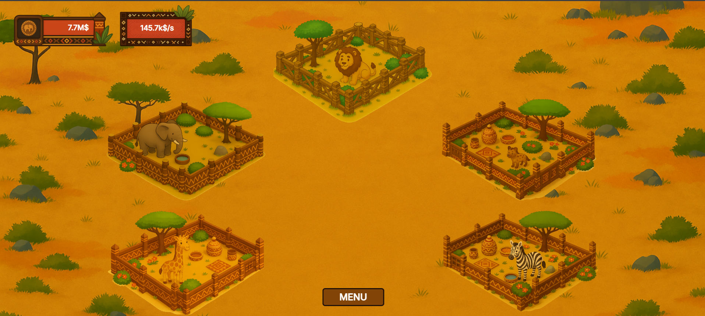

# 🐾 Clicker Zoo

**Clicker Zoo** est un jeu idle (incrémental) développé par Samuel Bouhnik-Loury, étudiant en B1 Cybersécurité à Ynov Sophia Campus. Le but est simple : cliquer, améliorer et étendre votre zoo pour générer toujours plus de pièces !

---

## 🎮 Fonctionnalités

- 🐘 Cliquez sur un enclos pour gagner des pièces.
- 🏗️ Achetez de nouveaux enclos avec vos gains.
- ⬆️ Améliorez les enclos pour :
  - Augmenter les gains par **clic**.
  - Générer des pièces automatiquement par **seconde**.
- 🎁 Des **bonus aléatoires** apparaissent sur certains enclos :
  - Multiplient temporairement vos gains.
  - Durée variable entre quelques secondes et une minute.

---

## 📸 Aperçu



## 🚀 Installation

1. Téléchargez ou clonez ce dépôt :
   ```bash
   git clone https://github.com/samuelblry/Clicker.git
2. Lancer le fichier HTML via Go Live